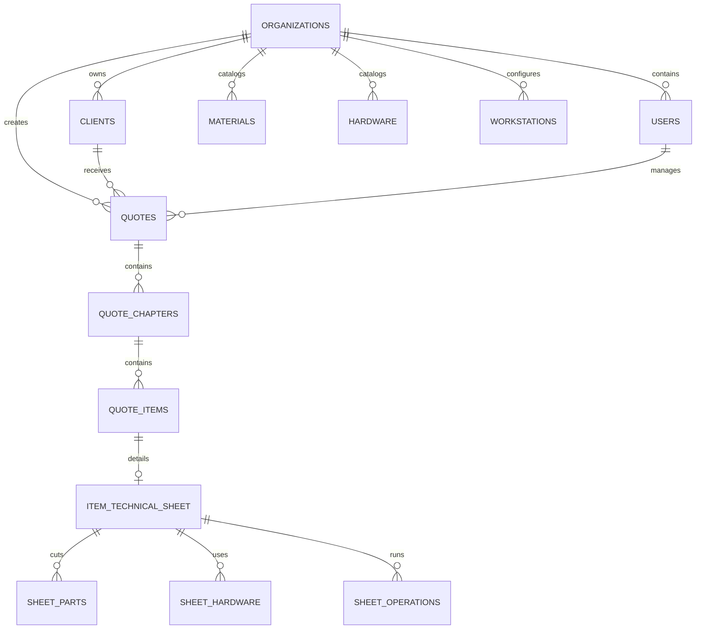

# Especificação Técnica de Arquitetura & Sistema de Orçamentos
**Empresa:** KUBIK HOME & LIFE FURNITURE  
**Design Reference:** Modular Dashboard (Estilo *Operum / Modern Clean SaaS*)  
**Infraestrutura:** Cloud Serverless (0€ de custos fixos, multi-utilizador, sem manutenção de servidores)

---

## 1. Visão Geral & Arquitetura Modular

O sistema é desenhado com uma **arquitetura orientada a módulos independentes (*Pluggable Modules*)**, inspirada no layout da interface de referência (Operum):


### 1.1. Estrutura do Layout (Shell da Aplicação)
* **Barra Lateral Esquerda (Sidebar):**
  * **Topo:** Identificação da Empresa (`KUBIK HOME Lda` - NIF 519021916).
  * **Navegação Modular:**
    * 📁 **Orçamentos** *(Módulo Ativo - Foco Inicial)*
    * 👥 **Clientes** *(Gestão de Contactos e NIFs)*
    * 🪵 **Catálogo & Materiais** *(Chapas, Ferragens e Custos/Hora)*
    * ⚙️ **Configurações Gerais** *(Condições de Venda, IVA, Dados da Empresa)*
    * *(Módulos Futuros já previstos sem alterar a base: 🏭 Produção / Obras, 📦 Stock, 📑 Faturação)*
  * **Rodapé da Sidebar:**
    * Perfil do Utilizador ativo (Nome, Email, Avatar) com botão de saída.
* **Área Principal (Content View):**
  * Topo com breadcrumbs contextuais, título da secção e botões de ação principal (ex: `+ Novo Orçamento`).
  * Área de dados rápida com filtros, pesquisa e cartões / tabelas responsivas.

---

## 2. Stack Tecnológica Recomendada (Zero Servidores Físicos)

Para permitir que 3 a 4 utilizadores acedam em qualquer lugar (PC, Portátil ou Tablet em obra) sem necessitarem de gerir servidores:

| Camada | Tecnologia | Motivo / Vantagem |
| :--- | :--- | :--- |
| **Frontend & UI** | **Next.js (React) + Tailwind CSS + Lucide Icons + Shadcn UI** | Interface ultra-rápida, idêntica ao design limpo do *Operum*. Componentes modulares reutilizáveis. |
| **Backend & Base de Dados** | **Supabase (PostgreSQL na Nuvem)** | Gratuito, seguro, backups diários automáticos, suporta múltiplos utilizadores em simultâneo sem conflitos de sincronização. |
| **Autenticação** | **Supabase Auth** | Login seguro para cada comercial/gerente com controlo de acessos. |
| **Motor de PDF** | **@react-pdf/renderer** | Gera os ficheiros PDF da KUBIK HOME com qualidade vetorial e visual idêntico ao ficheiro oficial atual. |
| **Alojamento (Deploy)** | **Vercel (Plano Hobby Gratuito)** | Disponível 24/7 num link seguro HTTPS sem pagar hospedagem. |

---

## 3. Modelo de Dados Relacional (Base de Dados)



### 3.1. Tabelas de Configuração Mestra

#### `materials` (Chapas e Painéis)
* `id` (UUID, PK)
* `code` (VARCHAR, ex: `'502114'`, `'502295'`)
* `name` (VARCHAR, ex: `'Linho 19mm'`, `'Linho 8mm'`, `'Branco MA 19mm'`)
* `length_mm` (DECIMAL, ex: `2500` ou `2800`)
* `width_mm` (DECIMAL, ex: `1830` ou `2070`)
* `thickness_mm` (DECIMAL, ex: `19`, `8`, `16`)
* `price_per_sheet` (DECIMAL, ex: `45.00`, `53.90`)
* `is_active` (BOOLEAN)

#### `workstations` (Postos de Trabalho e Máquinas)
* `id` (UUID, PK)
* `code` (VARCHAR, ex: `'SH'`, `'CNC'`, `'ORLADORA'`, `'MANUAL'`)
* `name` (VARCHAR, ex: `'Seccionadora'`, `'Centro de Maquinação CNC'`, `'Orladora'`, `'Montagem Bancada'`)
* `hourly_rate` (DECIMAL, ex: `35.00`, `18.09`, `25.00`, `25.00`)

#### `hardware` (Ferragens e Acessórios)
* `id` (UUID, PK)
* `code` (VARCHAR, ex: `'524314'`, `'524315'`, `'524317'`)
* `name` (VARCHAR, ex: `'Guia Lego Superior'`, `'Carro inferior met.roupeiro'`, `'Corrediça'`, `'Fita LED'`)
* `unit` (VARCHAR: `'un'`, `'metro'`, `'par'`)
* `unit_price` (DECIMAL, ex: `8.29`, `1.59`, `15.00`, `150.00`)

---

### 3.2. Tabelas de Orçamentos

#### `quotes` (Cabeçalho do Orçamento)
* `id` (UUID, PK)
* `quote_number` (VARCHAR, ex: `'2026-008'`, `'2026-056'`)
* `client_id` (UUID, FK -> `clients`)
* `user_id` (UUID, FK -> `users` - Responsável comercial)
* `date` (DATE, ex: `'2026-01-07'`)
* `project_name` (VARCHAR, opcional, ex: `'Residência da Boavista'`)
* `status` (ENUM: `'draft'`, `'sent'`, `'approved'`, `'rejected'`, `'in_production'`)
* `subtotal_cost` (DECIMAL)
* `subtotal_sell` (DECIMAL)
* `vat_rate` (DECIMAL, default `0.23`)
* `total_with_vat` (DECIMAL)
* `payment_conditions` (TEXT)
* `delivery_terms` (TEXT)

#### `quote_chapters` (Capítulos / Agrupamentos)
* `id` (UUID, PK)
* `quote_id` (UUID, FK -> `quotes`)
* `order_index` (INT, ex: `1`, `2`)
* `title` (VARCHAR, ex: `'Roupeiros'`, `'Portas'`, `'Mob Diverso'`)

#### `quote_items` (Linhas de Artigos)
* `id` (UUID, PK)
* `chapter_id` (UUID, FK -> `quote_chapters`)
* `item_number` (VARCHAR, ex: `'1.1'`, `'1.2'`, `'2.1'`)
* `designation` (TEXT, ex: `'Closet (2359+1733)x2725mm l Interior em Linho Cancun...'`)
* `unit` (VARCHAR, default `'un'`)
* `quantity` (DECIMAL, default `1.00`)
* `cost_unit` (DECIMAL) *(Calculado via Ficha Técnica ou Fórmula Rápida)*
* `cost_total` (DECIMAL, gerado: `quantity * cost_unit`)
* `margin_percent` (DECIMAL, ex: `0.40`, `0.60`, `0.70`)
* `fixed_extra` (DECIMAL, default `0.00`, ex: `200.00`, `50.00` para montagem/transporte)
* `sell_unit` (DECIMAL, gerado: `cost_unit * (1 + margin_percent) + fixed_extra`)
* `sell_total` (DECIMAL, gerado: `quantity * sell_unit`)
* `calculation_mode` (ENUM: `'quick'`, `'technical'`)

---

## 4. O Motor de Cálculo (Fórmulas Exatas do Excel)

Todas as fórmulas implementadas no software reproduzem **a 100%** a matemática das folhas de cálculo da KUBIK HOME:

### 4.1. Fórmulas da Folha Técnica de Produção (Modo Técnico)

#### A. Otimização e Rendimento de Peças por Chapa
Dadas as dimensões da chapa $X \times Y$ (em mm) e as dimensões da peça $Comp \times Larg$ ($M \times N$):
$$\text{Rend}_1 = \left\lfloor \frac{X}{Comp} \right\rfloor \times \left\lfloor \frac{Y}{Larg} \right\rfloor$$
$$\text{Rend}_2 = \left\lfloor \frac{X}{Larg} \right\rfloor \times \left\lfloor \frac{Y}{Comp} \right\rfloor$$
$$\text{Rendimento (O)} = \max(\text{Rend}_1, \text{Rend}_2)$$

*Utilização de Chapa por Peça (P):*
$$\text{Utilização} = \frac{\text{Quantidade Peças}}{\text{Rendimento}}$$

*Custo do Material da Peça (Q):*
$$\text{Custo Material} = \text{Utilização} \times \text{Preço da Chapa}$$

#### B. Cálculo de Metros Lineares de Orla
Para cada peça com $Comp$ ($M$) e $Larg$ ($N$) e quantidade ($L$):
$$X_{\text{comp}} = \frac{Comp \times 2}{1000} \times L$$
$$Y_{\text{larg}} = \frac{Larg \times 2}{1000} \times L$$
$$\text{Metros Totais de Orla} = \sum X_{\text{comp}} + \sum Y_{\text{larg}}$$
$$\text{Custo Total Orlas} = \text{Metros Totais} \times \text{Preço/Metro (0.70 €)}$$

#### C. Tempos de Máquina e Mão de Obra
Para cada operação (SH, CNC, Orladora, Manual):
$$\text{Custo Operação Direta} = \frac{\text{Tempo (min)} \times \text{Custo Hora (€/h)}}{60}$$
$$\text{Custo Setup} = \frac{\text{Tempo Setup (min)} \times \text{Custo Hora (€/h)}}{60}$$
$$\text{Custo Total Operações} = \sum (\text{Custo Direta} + \text{Custo Setup})$$

#### D. Ferragens Paramétricas do Roupeiro
* **Guias Lego (Superior e Inferior):**
  $$\text{Metros} = \frac{\text{Largura Roupeiro}}{1000}$$
  $$\text{Valor} = (\text{Preço Base} \times \text{Metros}) + \text{Acessório}$$
* **Carros e Fixadores:**
  $$\text{Qtd} = 2 \times \text{Nº de Portas}$$
* **Perfil Puxador TR19:**
  $$\text{Metros} = \frac{\text{Altura}}{1000} \times \text{Nº Portas} \times 2$$

#### E. Fecho do Custo de Produção da Peça
$$\text{Custo de Produção Total} = \text{Custo Operações} + \text{Custo Chapas} + \text{Custo Orlas} + \text{Custo Ferragens}$$

---

### 4.2. Fórmulas da Folha de Rosto / Documento de Orçamento (DO)

* **Custo Total da Linha ($G$):**
  $$G = E \times F \quad (\text{Qtd} \times \text{Custo Unitário})$$
* **Preço de Venda Unitário ($I$):**
  $$I = F \times (1 + H) + \text{Extra Fixo} \quad (\text{onde } H \text{ é a margem percentual, ex: 0.60, e Extra é montagem/transporte})$$
* **Preço de Venda Total da Linha ($J$):**
  $$J = E \times I \quad (\text{Qtd} \times \text{Preço Venda Unitário})$$
* **Sub-Total Proposta:**
  $$\text{SubTotal} = \sum J$$
* **IVA (23%):**
  $$\text{IVA} = \text{SubTotal} \times 0.23$$
* **Total Final da Proposta com IVA:**
  $$\text{Total Final} = \text{SubTotal} \times 1.23$$

---

## 5. Especificação dos Ecrãs (Fluxo de Utilização)

### Ecrã 1: Dashboard Geral de Orçamentos (Lista & Pipeline)
* **Cartões de KPI no Topo:**
  * Total Orçado no Mês Atual (€)
  * Propostas Adjudicadas (€)
  * Taxa de Sucesso (%)
  * Orçamentos Pendentes de Resposta
* **Tabela de Orçamentos:**
  * Colunas: `Nº Orçamento`, `Data`, `Cliente`, `Projeto / Obra`, `Responsável`, `Valor Total (c/ IVA)`, `Estado (Badge colorido)`, `Ações (Ver / PDF / Duplicar)`.
  * Filtros rápidos por estado (`Rascunho`, `Apresentado`, `Adjudicado`, `Perdido`).

### Ecrã 2: Editor de Orçamento (O Construtor)
* **Cabeçalho:** Seletor com pesquisa inteligente de Cliente (ou botão `+ Novo Cliente`), Data e Responsável Comercial.
* **Tabela Hierárquica:**
  * Botão `+ Novo Capítulo` (ex: "Roupeiros").
  * Dentro do capítulo: Botão `+ Adicionar Artigo`.
  * Para cada artigo:
    * Modo Rápido: Permite escrever texto livre ou fórmula rápida no campo de custo (ex: `(5.5*1.2)*160`).
    * Botão com ícone de régua/ferramentas: `[Abrir Desdobramento Técnico]`.
    * Inputs diretos de **Margem %** (slider ou campo numérico, ex: 60%) e **Extra Fixo** (ex: 200 €).
* **Barra Flutuante Inferior (Barra de Margem Comercial):**
  * Mostra em tempo real e de forma discreta para o comercial:
    * `Custo Total: 2.313,50 €` | `Venda: 3.901,60 €` | `Lucro Bruto: +1.588,10 € (40,7%)` | `Total c/ IVA: 4.798,97 €`
  * Botões de ação: `[Guardar Rascunho]`, `[Pré-visualizar PDF]`, `[Emitir Proposta Oficial]`.

### Ecrã 3: Modal de Desdobramento Técnico (A Calculadora)
* Interface em abas/tabelas:
  1. **Dimensões & Módulos:** Altura, Largura, Profundidade, Portas, Gavetas.
  2. **Tabela de Peças:** Lateral, Costa, Tampo, Base, Frentes com Comprimento, Largura e seleção de material.
  3. **Ferragens:** Tabela de seleção de ferragens da base de dados com quantidade.
  4. **Tempos de Máquina:** Minutos de corte, CNC, orladora e montagem.
* Resumo com cálculo automático do custo total da peça e botão: `[Importar Custo para o Orçamento]`.

---

## 6. Especificação da Geração do PDF Oficial (KUBIK HOME)

O PDF exportado tem **2 páginas oficiais** e segue o design original da marca:

```
+-------------------------------------------------------------+
| [LOGO KUBIK HOME]                COTAÇÃO DE PROJETO         |
|                                  Orçamento 2026-XXX         |
| DADOS CLIENTE:                   Data: DD/MM/AAAA           |
| Nome, NIF, Morada, Email, Tel    Responsável: [Nome]        |
+-------------------------------------------------------------+
| Art. | Designação Técnica           | Un. | Qtd | Unit | Tot|
| 1    | Roupeiros                    |     |     |      |    |
| 1.1  | Closet (2359+1733)x2725mm... | un  | 1,0 | 2212€|2212|
+-------------------------------------------------------------+
| Sub-Total:                                        3.901,60 €|
| *Valor final da Proposta*:                        3.901,60 €|
| *Valor com IVA à taxa em vigor*:                  4.798,97 €|
+-------------------------------------------------------------+
| [Rodapé Institucional: Zona Industrial do Tortosendo, NIF]  |
+-------------------------------------------------------------+
<!-- QUEBRA DE PÁGINA -->
+-------------------------------------------------------------+
| CONDIÇÕES GERAIS DE VENDA                                   |
| - Condições de Pagamento: 50% adjudicação, 50% finalização  |
| - Prazos de Entrega                                         |
| - Alterações & Validade (30 dias)                           |
| - Transporte e Montagem                                     |
| - Reclamações & Reserva de Propriedade                      |
| - Jurisdição (Tribunal da Covilhã)                          |
| - Política de Privacidade                                   |
| Assinaturas: [Comercial]   [Gerência]   [Cliente Aceite]    |
+-------------------------------------------------------------+
```

---

## 7. Master Prompt de Execução (Pronto para Construir)

O bloco abaixo contém a **instrução técnica integral e consolidada** para ser utilizada quando iniciares a fase de desenvolvimento da aplicação:

````markdown
### MASTER PROMPT: KUBIK HOME - MODULAR BUDGET & ESTIMATION PLATFORM

Build a high-performance, responsive multi-user Web Application for bespoke furniture and carpentry budgeting for **KUBIK HOME & LIFE FURNITURE**, inspired by modern SaaS layouts (like Operum / Linear).

#### 1. TECH STACK & INFRASTRUCTURE
- **Framework:** Next.js 14+ (App Router), React, TypeScript.
- **Styling & UI:** Tailwind CSS, Shadcn UI, Lucide Icons.
- **Backend & Database:** Supabase (PostgreSQL with Row Level Security, Auth, Realtime).
- **PDF Generation:** `@react-pdf/renderer` with official 2-page template replicating KUBIK HOME documents.

#### 2. CORE ARCHITECTURAL REQUIREMENTS
- **Modular Shell:** Left collapsible sidebar with Organization header (`KUBIK HOME`), Nav items (`Orçamentos` [Active], `Clientes`, `Materiais & Catálogo`, `Configurações`), and User Profile in footer. Designed so additional modules (`Produção`, `Stock`, `Faturação`) can be mounted in future without touching core logic.
- **Multi-user Support:** Accessible via browser on desktop, laptop, and tablet. 3-4 users working concurrently with personal accounts.

#### 3. DATA MODELS & ENTITIES
- `clients`: name, nif, address, email, phone, notes.
- `materials`: code (e.g. 502114), name (e.g. Linho 19mm, Linho 8mm, Branco MA 19mm), dimensions (length_mm, width_mm, thickness_mm), price_per_sheet.
- `workstations`: code (SH, CNC, ORLADORA, MANUAL), name, hourly_rate (e.g. 35.00, 18.09, 25.00, 25.00).
- `hardware`: code, name (Guias lego, carros, dobradiças, corrediças, LEDs), unit, unit_price.
- `quotes`: quote_number (e.g. 2026-009), client_id, user_id, date, project_name, status (draft, sent, approved, rejected), subtotal_cost, subtotal_sell, vat_rate (0.23), total_with_vat, terms.
- `quote_chapters`: quote_id, order_index, title (e.g. 1 Roupeiros, 2 Portas).
- `quote_items`: chapter_id, item_number (1.1, 1.2), designation, unit, quantity, cost_unit, cost_total, margin_percent (0.4 to 0.7), fixed_extra, sell_unit, sell_total.

#### 4. EXACT EXCEL CALCULATION ENGINE
Replicate exact carpentry calculations:
1. **Sheet Cutting Yield (Rendimento):**
   `Rend = Math.max(Math.floor(X/Comp) * Math.floor(Y/Larg), Math.floor(X/Larg) * Math.floor(Y/Comp))`
   `Usage = Qtd / Rend`
   `MaterialCost = Usage * SheetPrice`
2. **Edge Banding (Orlas):**
   `LinearMeters = ((Comp * 2 / 1000) + (Larg * 2 / 1000)) * Qtd`
   `EdgeCost = LinearMeters * PricePerMeter (0.70€)`
3. **Machine & Labor Costs:**
   `OpCost = (Minutes * HourlyRate) / 60`
   `SetupCost = (SetupMinutes * HourlyRate) / 60`
4. **Selling Price Formula:**
   `SellUnit = CostUnit * (1 + MarginPercent) + FixedExtra`
   `SellTotal = Quantity * SellUnit`
   `SubTotal = Sum(SellTotal)`
   `VAT = SubTotal * 0.23`
   `TotalFinal = SubTotal * 1.23`

#### 5. WORKFLOW & UX
- **Hybrid Budgeting:** Each quote item supports either (A) Quick estimation (direct cost or mathematical formula like `(5.5*1.2)*160`) or (B) Detailed Technical Breakdown Modal (piece-by-piece cut list, hardware list, machine time calculation).
- **Live Profitability Bar:** Shows commercial real-time margin percentage and net gross profit before finalizing.
- **1-Click PDF Generation:** Instant export matching official KUBIK HOME format:
  - Page 1: Client data, project name, quotation number, clean item table (designation, quantity, unit price, total price - NO internal costs or margins shown), subtotals, VAT, and company footer.
  - Page 2: General terms of sale (payment 50/50, IBAN Bankinter, delivery, 30 days validity, assembly terms, Covilhã court jurisdiction) and signature fields.
````
